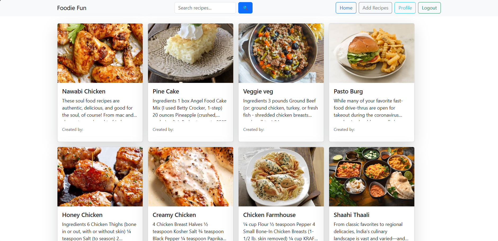
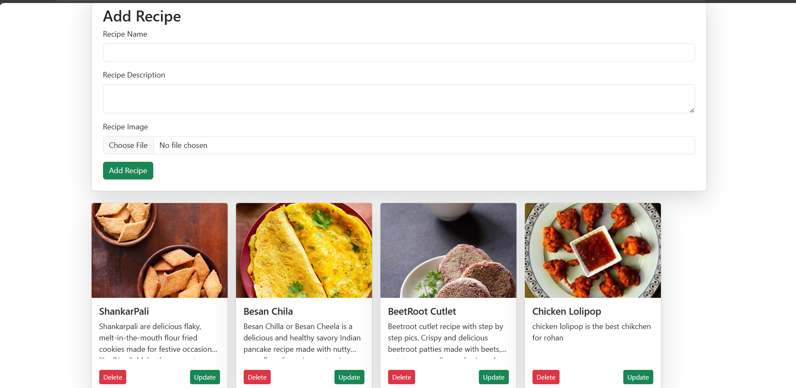

# Food Recipe Website 🍳

Welcome to the **Food Recipe Website**, a platform where food lovers can discover, share, and save their favorite recipes! This project includes a sleek and intuitive user interface for browsing recipes, adding your own creations, and managing your account. Here's an overview of the features and functionality of the website.

---

## 🌟 Features

1. **Home Page**  
   - Browse featured recipes.
   - Search for recipes by name or ingredients.
   - View categories (e.g., Vegan, Desserts, Quick Meals).

2. **Add Recipe Page**  
   - Submit your own recipe with a title, ingredients, steps, and an optional image.
   - Preview the recipe before submission.

3. **Login / Register Page**  
   - Secure login and registration system.
   - User authentication and session management.
   - Password reset functionality.

4. **Recipe Detail Page**  
   - View detailed instructions, ingredients, and nutritional information for any recipe.
   - Option to save the recipe to your personal favorites.

5. **Profile Page**  
   - View and manage your submitted recipes.
   - Edit or delete your recipes.
   - Update your account details.

6. **Responsive Design**  
   - Fully responsive, ensuring a seamless experience on desktops, tablets, and mobile devices.
   - Includes **authentication**, **authorization**, and **role-based access control** to manage different user permissions (e.g., admin vs regular users).

---

## 📂 Project Structure
Home Page

Update Page

